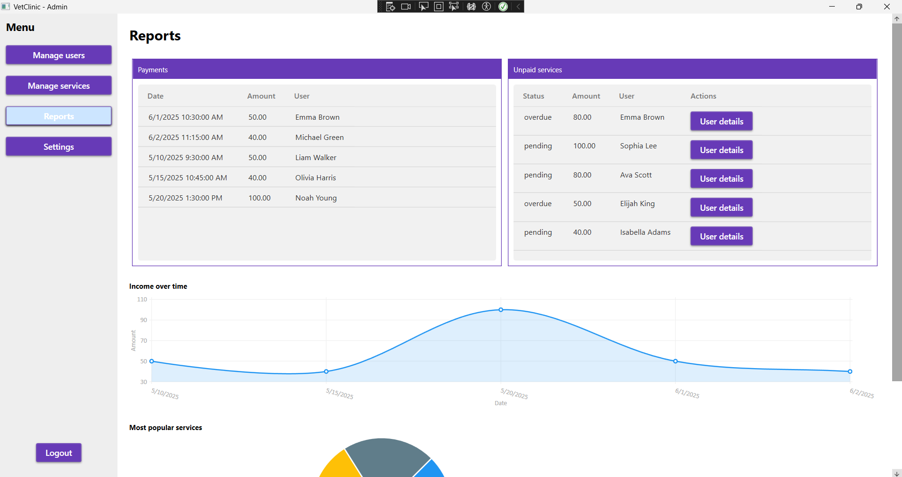
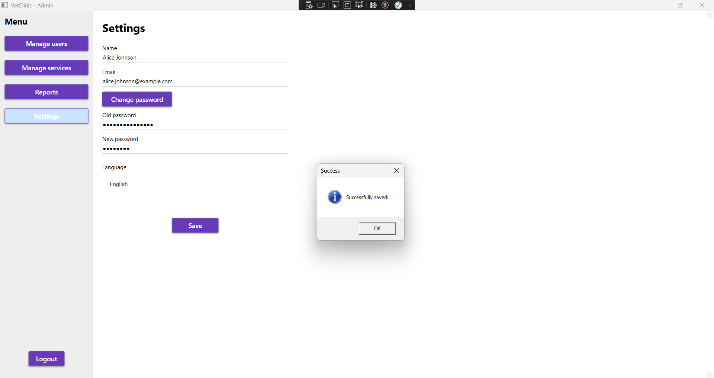

# 🐾 VetClinic – Veterinary Clinic Information System

This is a desktop WPF application designed for managing operations in a veterinary clinic. It includes role-based functionality for administrators and veterinarians, with shared features such as language settings and personal profile management.

---

## 📥 Getting Started

This is the startup window. You can change the language using the selector in the upper-right corner. The application requires login credentials. Users are assigned one of the following roles:

* **Administrator**
* **Veterinarian**

Upon login, users are redirected to their appropriate dashboard based on their role.

---

## 👤 Administrator Functionalities

### 🔐 User Management

Manage clinic staff such as veterinarians. You can:

* Add new users:

  

* Search users:

  

* Soft-delete users (mark as inactive):

  

---

### 💼 Service Management

Maintain the list of services offered at the clinic. You can:

* Add services:

  

* Edit services:

  

* Soft-delete services (mark as inactive):

  

* Search services using the search bar:

  

---

### 📊 Reports and Financial Overview

  

Gain insight into clinic performance. Features include:

* Table of completed payments
* List of unpaid services with user details
* Line chart of income over time
* Pie chart of most popular services

To view additional details about a user, click the **User Details** button:

---

## 🩺 Veterinarian Functionalities

### 📅 Appointment Management

Veterinarians can view and manage appointments that do not yet have medical records:

* Upcoming appointments
* Missed appointments (i.e., appointments in the past without a record)

Veterinarians can:

* View appointment details and add a medical record (Diagnosis, Treatment, Medications, Notes):

  

* Cancel appointments if necessary (soft delete them):

  

Appointments are filtered by ascending date.

---

### ✅ Closed Appointments

View all past appointments that already have an associated medical record.

Veterinarians can:

* Filter closed appointments by date:

  

* View details of any closed appointment:

  

---

### 🐕 Pets Overview

Veterinarians can:

* See all pets along with their owners
* View medical records for a selected pet and filter them by date:

  

* Search for pets by pet name or owner's name:

  

---

## ⚙️ Shared Settings (All Users)

### 🌍 Language & Profile Settings

Each user can:

* Change the application language (English, Serbian – Srpski)
* Update personal information (name, email, password)

Changes take effect after clicking **Save Changes**.

---

## 🔐 Logout Confirmation

When logging out, a confirmation dialog appears to prevent accidental logout.

---

## ✅ Action Confirmation

Each successful user action is followed by a confirmation message. For example, after updating profile information:

---

## 🛠 Technologies Used

* **WPF (.NET)**
* **MVVM Architecture**
* **Entity Framework Core**
* **MySQL**
* **LiveCharts for Graphs**
* **Material Design in XAML Toolkit**

---

## 📎 Notes

* All deletions in the system are **soft deletes**, meaning data remains in the database but is hidden from the user interface.
* The application is designed to support future expansion (e.g., reception roles, pet grooming modules) and adding new localizations.

---

> 📸 **Make sure all screenshots referenced in this document are placed inside the `Screenshots/` folder of the repository.**
